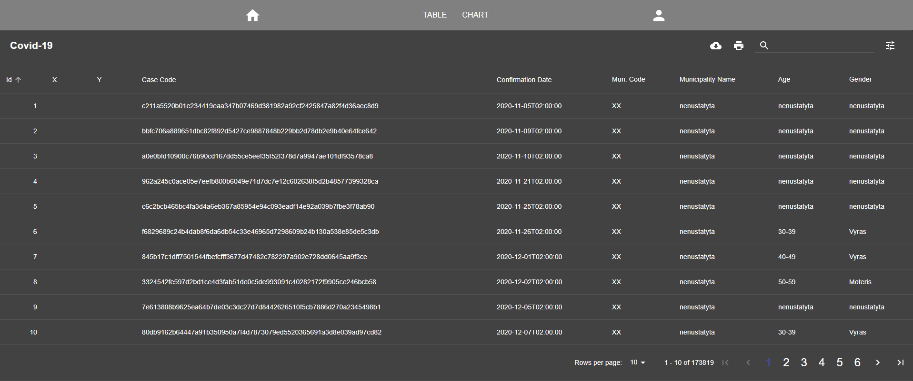
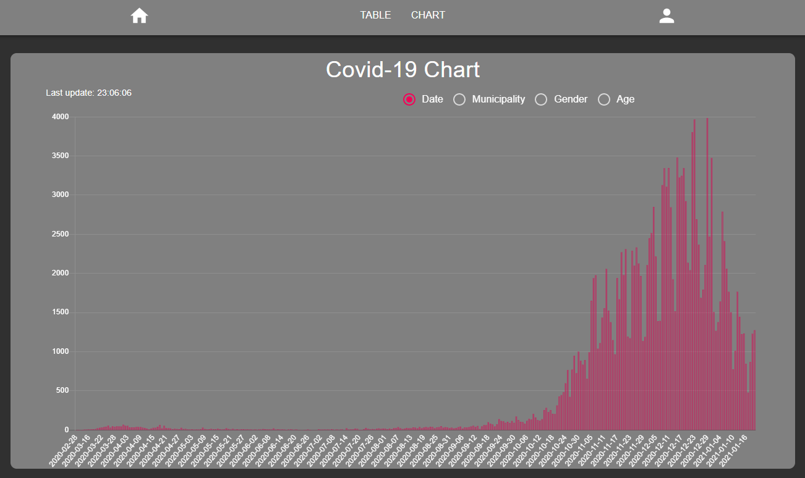

# Author: Mantas Mierkis 2021-02
# Project: Covid-19

## A few images of the final result

## Summary:

This web api is developed with Net Core .NET 5.0 to demonstrate crud operations using Entity Framework with Sql Server as a backend.

Project contains two Readme files: 'Readme' (Backend) and 'CovidReact\Readme' (Frontend)

## How to start:
Navigate to root project folder (where this readme is located)

	SQL

		Navigate to MSSQL folder  

		In CMD: docker-compose up  

		SQL should start in the container

	Web API (For now there is an issue with docker files for web api)

		Open *.sln file

		Start API project with IIS Express

		Initial start should take a while, database is prepopulated from .csv file

		Swagger should open (http://localhost:5001/index.html)

## Functionality

Requirements are met and the project is complete, but because there was a limited time interval, there are multiple 'todo' in the code.

If there is a need to improve this project, these 'todo' can help to point out improvement areas.

This Web Api uses database (Code first) ('Covid') with 2 tables:

	'Tests'

		Information about covid tests is stored in this table

		Table is populated from 'COVID19 cases.csv'

	'Credentials'

		Information about user credentials is stored in this table

		Table is populated with default user credentials: 'admin', 'admin'
	
Realtime chart updating is implemented using SignalR

## Additional Functionality

Swagger (API documentation)

## Tips:

#### Prepare database

Drop-Database
Remove-Migration
Add-Migration InitialCreate